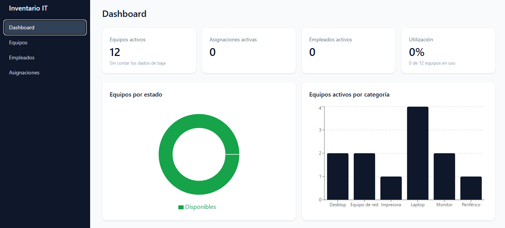
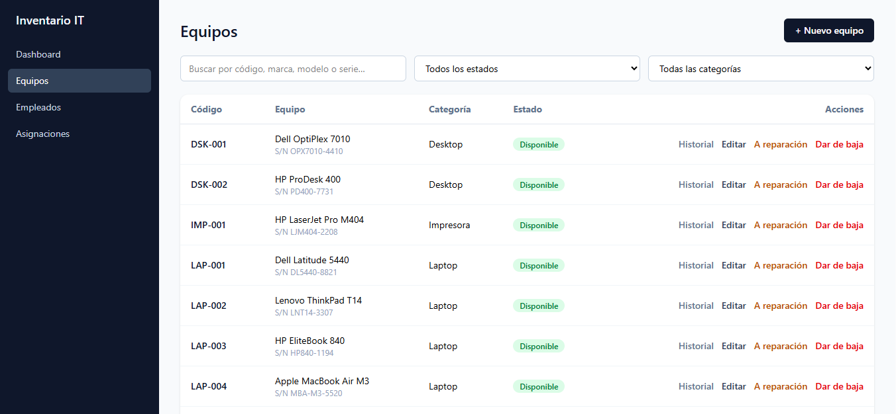
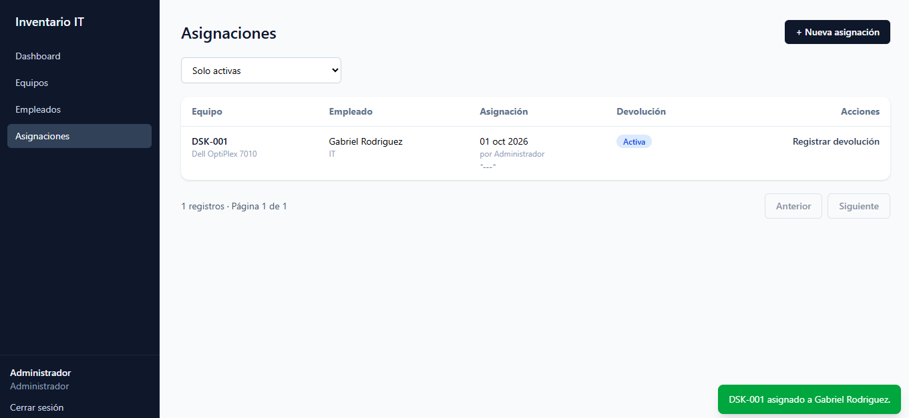
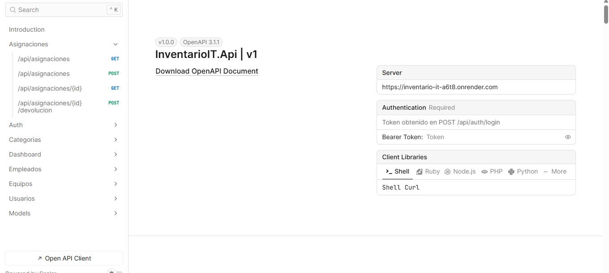
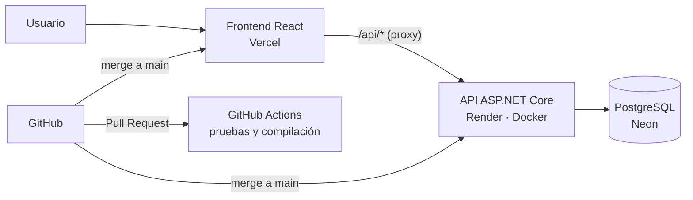

# Inventario IT 

[](https://github.com/Grodriguezdl/inventario-it/actions/workflows/ci.yml)

Sistema web para la **gestión de activos de IT**: registro de equipos, asignación a empleados, devoluciones, reparaciones e historial completo de cada equipo. Construido de punta a punta con **ASP.NET Core 10, PostgreSQL y React + TypeScript**, con autenticación por roles, pruebas automatizadas y despliegue continuo.

> *Full-stack IT asset management system: equipment tracking, employee assignments, returns, repairs and full history. Built with ASP.NET Core 10, PostgreSQL and React + TypeScript, featuring role-based authentication, automated tests and continuous deployment.*

##  Demo en vivo

| | |
|---|---|
| **Aplicación** | https://inventario-it-omega.vercel.app/login |
| **Documentación de la API** | https://inventario-it-a6t8.onrender.com/scalar |
| **Usuario de demo** | `demo@inventario-it.dev` |
| **Contraseña** | `Demo2026` |

>  La API está en un plan gratuito que se suspende tras unos minutos sin uso. Si la primera carga tarda cerca de un minuto, es el servidor despertando; después responde con normalidad.

##  Capturas

| Dashboard | Equipos |
|---|---|
|  |  |

| Asignaciones e historial | Documentación de la API |
|---|---|
|  |  |

##  Funcionalidades

**Equipos**
- Registro con código de inventario único, número de serie, marca, modelo, categoría y fecha de adquisición.
- Búsqueda por código, marca, modelo o serie, filtros por estado y categoría, y paginación.
- Ciclo de vida controlado: *Disponible → Asignado → En reparación → De baja*, con transiciones validadas.
- Baja lógica: un equipo dado de baja conserva todo su historial.

**Empleados**
- Registro con correo único, departamento y puesto.
- Desactivación bloqueada si el empleado tiene equipos asignados, y reactivación posterior.

**Asignaciones**
- Asignación de equipos disponibles a empleados activos, registrando automáticamente quién la realizó.
- Devolución indicando si el equipo vuelve disponible o a reparación, con observaciones.
- Historial completo por equipo o por empleado.

**Dashboard**
- Indicadores de equipos activos, asignaciones, empleados y porcentaje de utilización.
- Gráficas de equipos por estado y por categoría, y últimas asignaciones.

**Seguridad**
- Inicio de sesión con JWT y contraseñas almacenadas con hash.
- Roles **Administrador** y **Técnico**: las acciones críticas (bajas, gestión de usuarios) son exclusivas del administrador.

## Arquitectura



El backend está organizado en capas: los **controladores** solo reciben y responden peticiones HTTP, los **servicios** contienen las reglas de negocio y **Entity Framework Core** se encarga del acceso a datos. Los **DTOs** separan lo que expone la API de las entidades de la base de datos.

##  Tecnologías

| Capa | Tecnologías |
|---|---|
| **Backend** | C#, ASP.NET Core 10 (Web API), Entity Framework Core, JWT Bearer |
| **Base de datos** | PostgreSQL (Npgsql), migraciones de EF Core |
| **Frontend** | React 19, TypeScript, Vite, Tailwind CSS, React Router, TanStack Query, Recharts |
| **Pruebas** | xUnit, pruebas de integración contra PostgreSQL real |
| **DevOps** | Docker (multi-stage), GitHub Actions, Render, Vercel, Neon |
| **Documentación** | OpenAPI + Scalar |

##  Decisiones técnicas

- **Usuarios y empleados son entidades distintas.** Los usuarios operan el sistema e inician sesión; los empleados solo reciben equipos. Así un empleado no necesita cuenta ni contraseña.
- **Nunca se borran registros con historial.** Equipos y empleados se dan de baja o se desactivan, y las relaciones usan borrado restringido. El historial de asignaciones queda siempre completo.
- **Integridad garantizada por la base de datos.** Un índice único filtrado (`WHERE "FechaDevolucion" IS NULL`) impide que un equipo tenga dos asignaciones activas, incluso si dos usuarios lo asignan al mismo tiempo. La API detecta la violación y responde con un conflicto claro.
- **Errores consistentes.** Las reglas de negocio lanzan excepciones específicas que un manejador global convierte en respuestas estándar *Problem Details* (400, 401, 404, 409), sin bloques `try/catch` repetidos.
- **Seguro por defecto.** Una política de autorización global exige autenticación en todos los endpoints salvo los marcados explícitamente como públicos. El usuario que registra cada asignación se toma del token, nunca del cuerpo de la petición.
- **Sin secretos en el repositorio.** Las credenciales viven en *User Secrets* durante el desarrollo y en variables de entorno en producción.
- **Pruebas contra PostgreSQL real.** Parte de la lógica depende de características de PostgreSQL (búsqueda sin distinguir mayúsculas, índices filtrados), por lo que las pruebas usan una base real creada con las mismas migraciones de producción.
- **Sin configuración de CORS.** El frontend siempre llama a `/api`: en desarrollo lo redirige el proxy de Vite y en producción las reglas de Vercel, de modo que el navegador ve un único origen.

##  Estructura del proyecto

```
inventario-it/
├── backend/
│   ├── InventarioIT.Api/        # API: controladores, servicios, DTOs, entidades y migraciones
│   ├── InventarioIT.Tests/      # Pruebas de integración con xUnit
│   └── Dockerfile
├── frontend/
│   └── src/
│       ├── api/                 # Cliente HTTP y tipos
│       ├── auth/                # Sesión y rutas protegidas
│       ├── components/          # Layout y componentes reutilizables
│       └── pages/               # Pantallas
├── scripts/
│   └── cargar-demo.sh           # Carga de datos de demostración
└── .github/workflows/ci.yml     # Integración continua
```

##  Ejecutar en local

**Requisitos:** .NET SDK 10, Node.js 22 y PostgreSQL.

**1. Backend**

```bash
cd backend
dotnet user-secrets set "ConnectionStrings:DefaultConnection" "Host=localhost;Port=5432;Database=inventario_it;Username=postgres;Password=TU_CONTRASEÑA" --project InventarioIT.Api
dotnet user-secrets set "Jwt:Key" "$(head -c 48 /dev/urandom | base64)" --project InventarioIT.Api
dotnet user-secrets set "Seed:AdminEmail" "admin@inventario.local" --project InventarioIT.Api
dotnet user-secrets set "Seed:AdminPassword" "TU_CONTRASEÑA_ADMIN" --project InventarioIT.Api

dotnet tool install --global dotnet-ef
dotnet ef database update --project InventarioIT.Api
dotnet run --project InventarioIT.Api
```

La API queda en `http://localhost:5117` y su documentación en `http://localhost:5117/scalar`. Al primer arranque se crea el administrador configurado.

**2. Frontend** (en otra terminal)

```bash
cd frontend
npm install
npm run dev
```

La aplicación queda en `http://localhost:5173`.

**3. Datos de demostración (opcional)**

```bash
bash scripts/cargar-demo.sh http://localhost:5117
```

##  Pruebas

El proyecto incluye **26 pruebas de integración** que cubren las reglas de negocio: códigos y correos duplicados, transiciones de estado, asignaciones, devoluciones, autenticación y la restricción de unicidad en la base de datos.

```bash
cd backend
dotnet user-secrets set "ConnectionStrings:Tests" "Host=localhost;Port=5432;Database=inventario_it_tests;Username=postgres;Password=TU_CONTRASEÑA" --project InventarioIT.Tests
dotnet test
```

En cada Pull Request, **GitHub Actions** compila el backend y el frontend y ejecuta las pruebas contra un PostgreSQL temporal. La rama `main` está protegida: solo acepta cambios que pasen todas las verificaciones, y cada merge despliega automáticamente la API y el frontend.

##  Mejoras futuras

- Carga diferida de páginas (*lazy loading*) para reducir el tamaño inicial del frontend.
- Exportación de reportes de inventario y asignaciones a Excel o PDF.
- Registro de auditoría de todos los cambios.
- Gestión de usuarios desde la interfaz y cambio de contraseña.
- Pruebas de extremo a extremo del frontend.

##  Autor

**Gabriel Rodríguez**
[GitHub](https://github.com/Grodriguezdl) · [LinkedIn](https://www.linkedin.com/in/gabriel-rodriguez-90135936b)
